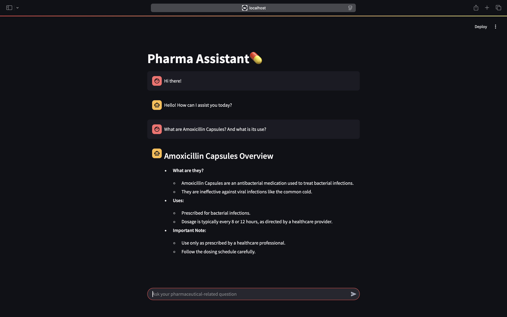

# Pharma Knowledge Assistant💊

## Project Overview

The Pharma Knowledge Assistant is a comprehensive tool designed to assist users with pharmaceutical-related queries. It leverages a combination of Agentic-Retrieval Augmented Generation, a pharmaceutical knowledge base, and a user-friendly interface to provide detailed, accurate, and helpful information about medications, their alternatives, dosages, side effects, and more.

## Project Structure

The project is organized into several key components:

- **src/**: Contains the main source code for the project.
  - **main.py**: The main entry point for the Streamlit application.
  - **data-processing.py**: Script for processing and embedding pharmaceutical data into ChromaDB.
  - **supervisor_arch.ipynb**: Jupyter notebook for an step-by-step workflow the supervisor architecture and agents with the agentic workflow.
- **datasets/**: Contains JSON files with pharmaceutical data.
- **chroma_db/**: Directory for ChromaDB storage.
- **requirements.txt**: Lists all the dependencies required for the project.
- **web_scrapper.py**: Script for scraping pharmaceutical data from specified URLs.
- **actual_dataset.zip**: Compressed file containing the raw dataset.
- **pes_esa_hackathon.pdf**: PDF document that contains the problem statement.

## Setup Instructions

### Prerequisites

Ensure you have the following installed on your system:

- Python 3.12.7 or later
- pip (Python package installer)

### Installation

1. **Clone the repository:**

   ```sh
   git clone 
   cd pharma-knowledge-assistant
   ```
2. **Create a virtual environment:

   ```sh
   python -m venv venv
   source venv/bin/activate 
   ```
3. Install the required packages:

   ```
   pip install -r requirements.txt
   ```

## Configuration

1. Process the document folder and store populate the database, with the vectorised chunks of the dataset.

   ```
   python src/data-processing.py
   ```
2. Configure API keys:
   Update the api_key in main.py and supervisor_arch.ipynb with your OpenAI API key.

   ```
   llm = ChatOpenAI(
   temperature=0,
   api_key="your_openai_api_key",
   model="gpt-4o-2024-11-20"
   )
   ```

## Running the Application

1. Start the Stremlit applicaton

   ```
   streamlit run src/main.py
   ```
2. Access the application:

Open your web browser and navigate to http://localhost:8501 to interact with the Pharma Knowledge Assistant.

## Usage

* Ask Questions: Use the chat input to ask any pharmaceutical-related questions.
* Get Recommendations: Receive medication recommendations based on symptoms or conditions.
* Find Alternatives: Get safe alternatives for medications.
* Summarize Products: Obtain concise summaries of pharmaceutical products.

## Supervisor Agentic Architecture


This diagram demonstrates how agents interact with the pharmaceutical knowledge base and respond to user queries.

## Screenshots

### Data-Processing


### UI

